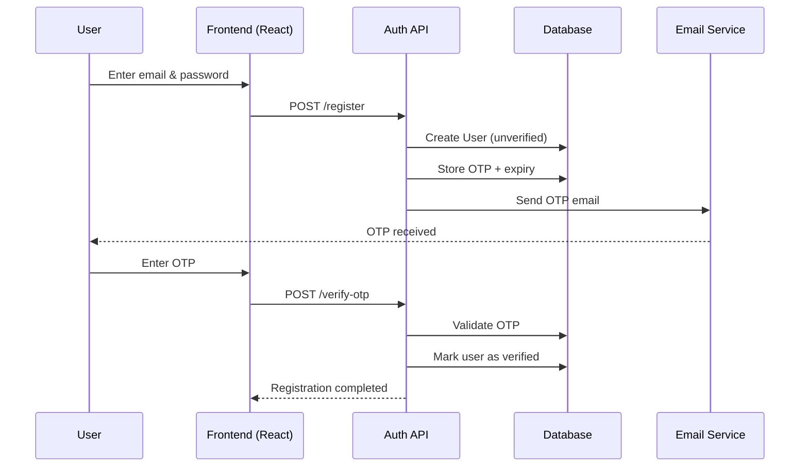
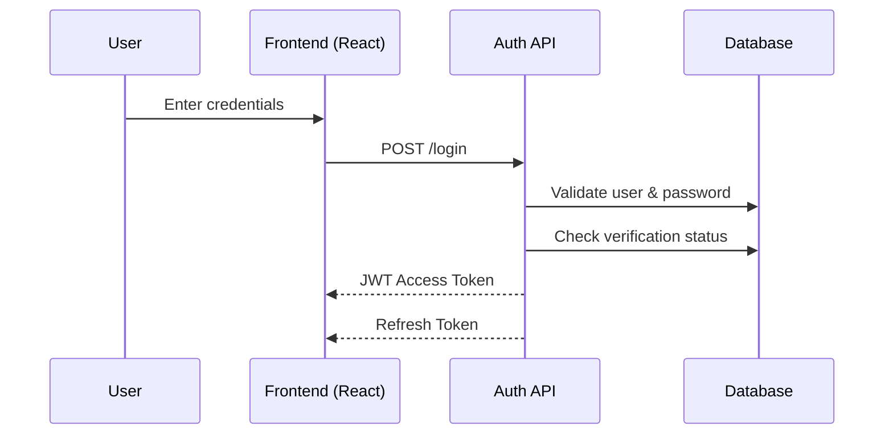
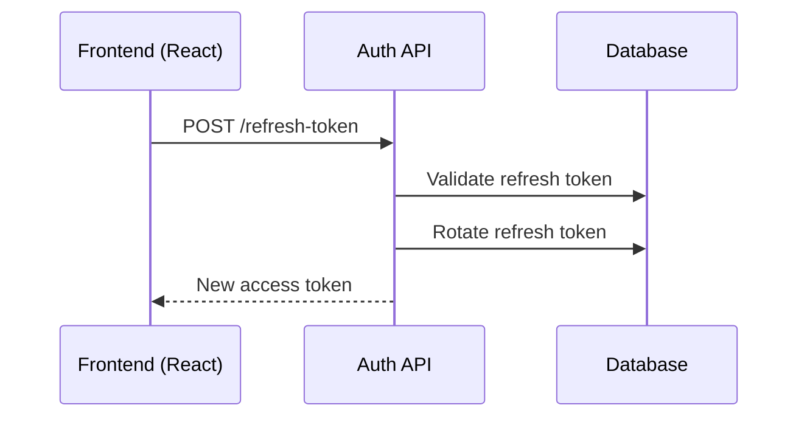
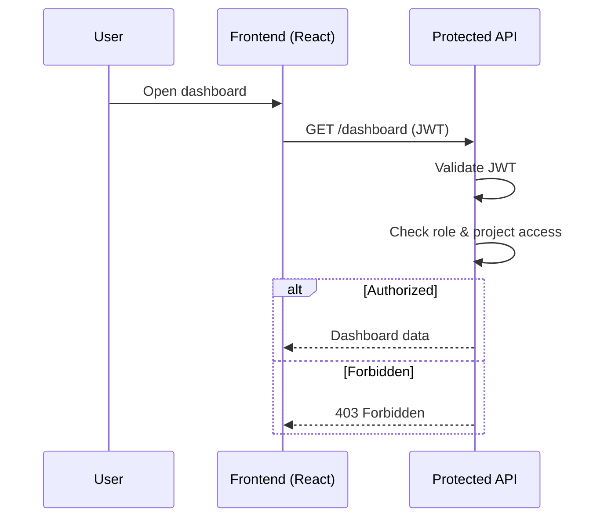
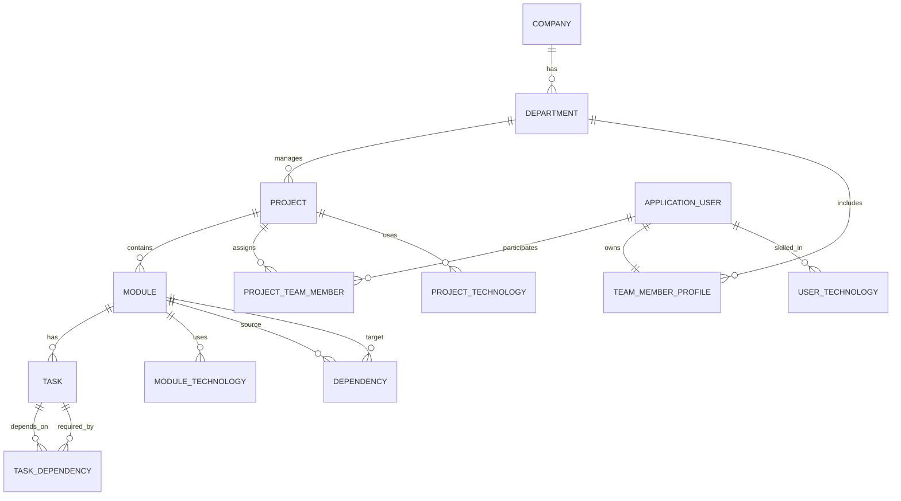

# DependencySystem

> **Enterprise-grade Project, Module, and Task Dependency Management System**

DependencySystem is a **portfolio-grade, real-world organizational dependency management platform** developed as part of the **PG-DAC (Post Graduate Diploma in Advanced Computing)** course. It models how modern software companies manage **companies, departments, projects, modules, tasks, teams, and complex dependencies**.

Built with **ASP.NET Core Web API**, **Entity Framework Core**, **Identity**, and a **React frontend**, this system focuses on **scalability, clean architecture, and production-ready relationship modeling**.

---

## 🎥 Demo Flow (Admin → Manager → Developer)

This section explains the **end-to-end working of the system** through real user roles. It is especially useful for **PG-DAC demos, viva, and interviews**.

---

### 👑 Admin Flow

**Objective:** System setup & governance

1. Admin logs in to the system
2. Creates **Company** and **Departments**
3. Creates **Projects** under departments
4. Assigns **Managers** to projects
5. Manages global **Technologies**
6. Monitors **Audit Logs**

**Key Concepts Demonstrated:**

* Role-based authorization
* Organization hierarchy
* System-level access control

---

### 🧑‍💼 Manager Flow

**Objective:** Project planning & dependency management

1. Manager logs in
2. Views assigned projects
3. Creates **Modules** under projects
4. Defines **Module Dependencies** (prerequisites)
5. Breaks modules into **Tasks**
6. Assigns **Developers** to tasks
7. Tracks blocked modules/tasks

**Key Concepts Demonstrated:**

* Project-scoped roles
* Dependency graph creation
* Business rule enforcement

---

### 👨‍💻 Developer Flow

**Objective:** Task execution & progress tracking

1. Developer logs in
2. Views assigned tasks
3. Checks **dependency blockers**
4. Updates task status (InProgress / Completed)
5. Unblocks dependent tasks automatically

**Key Concepts Demonstrated:**

* Fine-grained access control
* Dependency resolution
* Real-time workflow impact

---

### 🔄 End-to-End Example Scenario

> *A project cannot be deployed because a core module is blocked.*

* Admin verifies team structure
* Manager identifies a blocked module dependency
* Developer completes prerequisite task
* System automatically updates dependency state
* Project progresses without manual intervention

This flow demonstrates how **DependencySystem mirrors real software development lifecycles**.

---

## 🔁 Authentication Flow Diagrams (Sequence)

### 📝 User Registration & OTP Verification



---

### 🔑 Login + Token Generation



---

### ♻️ Access Token Refresh Flow



---

### 🛂 Role-Based Dashboard Authorization



---

## 🚀 Why DependencySystem?

Most student projects stop at simple CRUD.

**DependencySystem goes further**:

* Models real organizational hierarchies
* Handles complex dependency graphs (module & task level)
* Supports role-based project teams
* Tracks technologies per project, module, and user
* Uses enterprise authentication patterns

This makes it suitable for:

* **PG-DAC final / internal evaluation project**
* Engineering portfolio showcase
* Internship & fresher interviews
* Demonstrating enterprise backend architecture
* Real internal tooling concepts

---

## 🏗️ System Architecture

### Organization Structure

```
Company
 └── Department
      └── Project
           └── Module
                └── Task
```

### Dependency Graphs

* **Module Dependencies** (module → module)
* **Task Dependencies** (task → task)

Circular deletions are prevented using restrictive delete behaviors.

---

## ✨ Key Features

### 🏢 Organization Management

* Company & Department hierarchy
* Unique department names per company

### 📦 Project & Module Management

* Projects scoped under departments
* Modules scoped under projects
* Enum-based status tracking (Pending, InProgress, Completed, Blocked)

### ✅ Task Management

* Tasks scoped under modules
* Task-level dependency graph
* Status tracking and validation

### 🔗 Dependency Engine

* Module-to-module dependency graph
* Task-to-task dependency graph
* Duplicate and circular dependency protection

### 👥 Team & Role Management

* One-to-one User ↔ Profile mapping
* Project-based team membership
* Role-based assignment (Admin, Manager, Developer, Maintainer)

### 🧰 Technology Stack Mapping

* Project ↔ Technology
* Module ↔ Technology
* User ↔ Technology

### 🔐 Authentication & Security

### 👤 User Registration

* User registers using **email & password**
* ASP.NET Core Identity handles password hashing & validation
* User account is created in `AspNetUsers`
* Linked **TeamMemberProfile** is created automatically

### ✉️ User Verification (OTP)

* OTP is generated and sent to registered email
* OTP is stored securely with expiry
* User must verify OTP before account activation
* Duplicate email verification is prevented using unique index

### 🔑 Login Flow

* Verified users can log in using email & password
* JWT Access Token is issued on successful login
* Refresh Token is stored securely and rotated
* Invalid or expired tokens are rejected

### 🛂 Role-Based Authorization

* Roles managed using **ASP.NET Identity Roles**
* Roles include:

  * Admin
  * Manager
  * Developer
  * Maintainer
* Role is also tracked at **Project level** via `ProjectTeamMember`

### 📊 Role-Based Dashboards

#### Admin Dashboard

* Manage companies & departments
* Create projects & assign managers
* View system-wide audit logs

#### Manager Dashboard

* Manage projects & modules
* Assign team members & roles
* Track module & task dependencies

#### Developer Dashboard

* View assigned projects & tasks
* Update task status
* View dependency blockers

#### Maintainer Dashboard

* Monitor system health
* Review audit logs
* Manage technologies & dependencies

Authorization is enforced using:

* `[Authorize]` attributes
* Role-based policies
* Project-scoped access checks

---

## 🛠️ Tech Stack

### Backend

* **ASP.NET Core Web API**
* **Entity Framework Core**
* **ASP.NET Identity**
* **MySQL / SQL Server**

### Frontend

* **React.js**
* **Axios**
* **Role-based Dashboards**

### Architecture Principles

* Clean Architecture
* DTO-based data flow
* Explicit relationship modeling
* Enterprise delete behaviors

---

## 📂 Project Structure (Backend)

```
DependencySystem.API
 ├── Controllers
 ├── Services
 ├── DTOs
 ├── Entities
 ├── Enums
 ├── Data
 │    └── ApplicationDbContext.cs
 └── Program.cs
```

---

## 🧩 ER Diagram (Entity Relationship)



This ER diagram reflects **real enterprise database normalization**, including:

* Proper many-to-many join tables
* Self-referencing dependency graphs
* Role-based user participation

---

## 🔗 Dependency Diagram (Logical Flow)

### Module Dependency Graph

```
[Auth Module] ──▶ [User Module] ──▶ [Project Module]
                         │
                         └──▶ [Audit Module]
```

### Task Dependency Graph

```
[Design API]
     │
     ▼
[Implement Services]
     │
     ▼
[Write Unit Tests]
     │
     ▼
[Deploy]
```

Dependency rules:

* A module/task **cannot depend on itself**
* Circular dependencies are blocked at service level
* Deletions are restricted to protect graph integrity

---

## 🧠 Database Design Highlights

* Composite keys for many-to-many tables
* Enum-to-string conversions for readability
* Restrictive deletes to prevent data loss
* Unique indexes for business rules

This mirrors **real enterprise database design**, not demo schemas.

---

## 🧪 Example Use Cases

* Track project dependencies before deployment
* Detect blocked modules and tasks
* Assign developers based on technology expertise
* Analyze impact of module changes

---

## 📈 Future Enhancements

* Dependency cycle detection algorithm
* Gantt & dependency visualization
* Notification system for blocked tasks
* CI/CD & GitHub integration
* Reporting dashboards

---

## 🎓 Academic Context

This project is developed as part of the **PG-DAC (Post Graduate Diploma in Advanced Computing)** program.

It is intentionally designed beyond syllabus-level CRUD to demonstrate **practical application of PG-DAC concepts** in a single integrated system.

---

## 📚 PG-DAC Learning Outcomes Mapped to Features

| PG-DAC Module / Concept           | How It Is Applied in DependencySystem                                                                          |
| --------------------------------- | -------------------------------------------------------------------------------------------------------------- |
| **Core Java & OOP**               | Domain-driven entity modeling (Company, Project, Module, Task), enums, inheritance, clean object relationships |
| **Advanced Java**                 | Layered architecture, DTO mapping, service abstractions, exception handling                                    |
| **Database Technologies (RDBMS)** | Normalized schema, composite keys, foreign keys, unique constraints, indexing                                  |
| **SQL & Data Modeling**           | ER diagrams, many-to-many join tables, self-referencing dependency graphs                                      |
| **Web Programming**               | RESTful APIs, HTTP status codes, request/response lifecycle                                                    |
| **.NET / Backend Frameworks**     | ASP.NET Core Web API, middleware, filters, dependency injection                                                |
| **ORM (Hibernate / EF Core)**     | Entity Framework Core, Fluent API, migrations, enum conversions                                                |
| **Authentication & Security**     | ASP.NET Identity, JWT authentication, refresh tokens, OTP verification                                         |
| **Role-Based Access Control**     | System roles + project-level roles with policy-based authorization                                             |
| **Software Engineering**          | Clean architecture, separation of concerns, scalable design                                                    |
| **Data Structures & Algorithms**  | Dependency graphs, prerequisite relationships, cycle prevention logic                                          |
| **Distributed Systems Basics**    | Stateless JWT authentication, token-based access                                                               |
| **Frontend Integration**          | React dashboards, protected routes, role-based UI rendering                                                    |
| **DevOps Fundamentals**           | Git version control, structured commits, environment configuration                                             |

This mapping clearly demonstrates how **PG-DAC theoretical learning is translated into a real, production-style application**.

---

## 🧑‍💻 Author

**Yuvraj Rathod**
Final-year Computer Engineering student
Focused on scalable backend systems and real-world software architecture

---

## ⭐ How to Use

1. Clone the repository
2. Configure database connection
3. Run migrations
4. Start backend & frontend
5. Explore enterprise-level dependency management

---

> *This project is intentionally designed to reflect how real organizations structure and manage complex software systems.*
